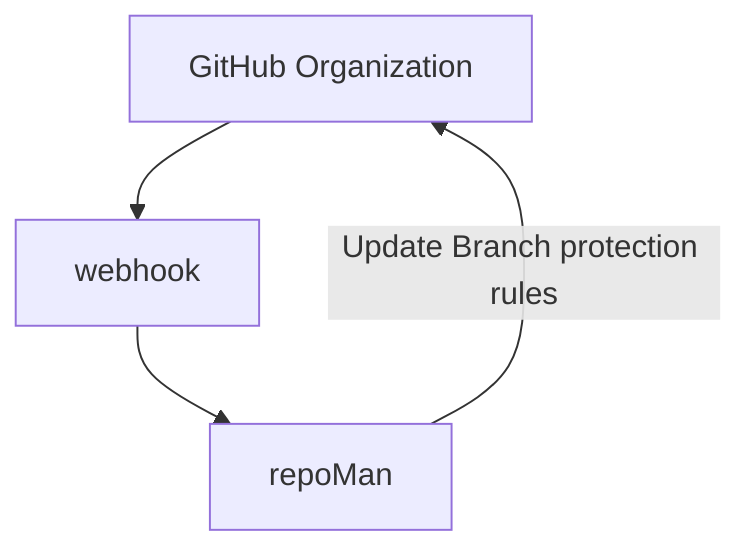

# go-repo-man
***A settings manager for GitHub repositories***

**Note**:  The code in this repository show one of many ways to manage your repo security. It is not intended to be used outside of a development environment. Do so at your own risk.

## Table of contents

+ [Summary](#summary)
  + [What's Needed?](#whats-needed)
  + [Getting Started](#getting-started)
    + [Microservices](#microservices)

## Summary

 As many companies are moving towards policy driven resource management, this project has been created as an example of how to manage your `Organizations` GitHub repositories as code. The microservice created serves 2 functions. The primary(main?) function is to act as an ingress point for your GitHub `Organizations` webhooks which notifies the `repoMan` function to secure your newly created repositories using `branch protection rules`. For more information on what rules are available click [here](https://docs.github.com/en/repositories/configuring-branches-and-merges-in-your-repository/defining-the-mergeability-of-pull-requests/managing-a-branch-protection-rule)

For this project we are using a **GoLang** microservice as a notification ingress point for GitHub webhooks. Once a notification payload is received, we send a our `branch protection rules` with the GitHub REST [API](https://docs.github.com/en/rest) using the [GitHub REST API client for Golang](https://github.com/google/go-github) from [Google](https://github.com/google). Go was chosen for it's ability to be compact and compiled for any OS and eaze of containterization.

## What's Needed?

- **Go**: Go `v1.18.3` was used for all local development and testing. All required submodules can be found in the [go.mod](go.mod) file or in the import secion of the [main.go](main.go). It was tested with both `v1.17.1` and `v1.18.3` of **GoLang**. For information on installing **GoLang** see the documentation [here](https://go.dev/doc/install)
- **GitHub Organization**:  You will need a GitHub `Organization` to test this example. A free tier Organization will allow you to test with public repositories. It is strongly suggested that you  use a test organization first so that changes are not accidentally introduced into production environments. [See Info](https://docs.github.com/en/organizations/collaborating-with-groups-in-organizations/creating-a-new-organization-from-scratch)
- **Github Access**: You will need a github account with Administrative rights to the Organization for setting up an organization webhook.
- **GitHub Organization Webhook**: You will need to create an Organization webhook to communicate with your microservice.
  - **Note**: you will want to create a secret for your webhook and store it for later use
- **Hosting for Web App**: This microservice can be deployed to any webserver that has a publicly available dns address. AWS ECS with Fargate, EC2, AZURE, Heroku etc.  [Heroku](https://www.heroku.com/) was used in this example.

## Getting Started

Once compiled, the code in this repository run as a standalone microservice to ingest, validate and act upon webhook events from a GitHub organization. This will apply default configurations to all newly created repositories and their default branch.



#### Microservices

- `main.go`: All functional logic is contained in this file.
  - The `main` function creates our listening service using go's builtin `net/http` libraries with a function handler to communicate with the `go-github` library.
  ```go
  func main() {
	port := os.Getenv("PORT")
	log.Println("server started")
	http.HandleFunc("/test", repoMan)
	log.Fatal(http.ListenAndServe(":"+port, nil))
  }
  ```
  - the `repoMan` function parses the payload from our GitHub webhook, validates the type of event and, sends instructions back to the Github API based on the event type.

  The first part handles client connection
  ```go
  // This portion handles the client connection
  func repoMan(w http.ResponseWriter, r *http.Request) {
	ghtoken := os.Getenv("GHTOKEN")
	whsecret := os.Getenv("WHSECRET")
	ctx := context.Background()
	// flag.Parse()
	context := context.Background()
	tokenService := oauth2.StaticTokenSource(
		&oauth2.Token{AccessToken: ghtoken},
	)
	tokenClient := oauth2.NewClient(context, tokenService)

	client := github.NewClient(tokenClient)
  ```

  This section handles payload verification and and parses the events
  ```go
  	payload, err := github.ValidatePayload(r, []byte(whsecret))
	if err != nil {
		log.Printf("error validating request body: err=%s\n", err)
		return
	}
	defer r.Body.Close()

	event, err := github.ParseWebHook(github.WebHookType(r), payload)
	if err != nil {
		log.Printf("could not parse webhook: err=%s\n", err)
		return
	}
  ```

  Finally, this section is a portion of the decision engine that sends instructions to the GitHub API. For more information on how this library works with the API see [here](https://pkg.go.dev/github.com/google/go-github@v17.0.0+incompatible/github#RepositoriesService.UpdateBranchProtection)

  ```go
  case *github.RepositoryEvent:
	//https://docs.github.com/en/developers/webhooks-and-events/webhooks/webhook-events-and-payloads#repository
	// this is a repository event
	// this is where we manage the security settings
	if e.Action != nil && *e.Action == "created" {
	log.Printf("%s new repository created. configuring security %s\n")
	issue := &github.IssueRequest{
		Title:    github.String("New repo Created"),
		Body:     github.String("@sam1el this repo was created"),
		Assignee: github.String("sam1el"),
	}
	preq := &github.ProtectionRequest{
		EnforceAdmins: true,
		RequiredPullRequestReviews: &github.PullRequestReviewsEnforcementRequest{
			RequiredApprovingReviewCount: 2,
			DismissStaleReviews:          true,
			RequireCodeOwnerReviews:      true,
		},
	}
	client.Repositories.UpdateBranchProtection(ctx, *org, *e.Repo.Name, "main", preq)
	client.Repositories.AddAdminEnforcement(ctx, *org, *e.Repo.Name, "main")
	client.Issues.Create(ctx, *org, *e.Repo.Name, issue)
	}
    ```

- You will need the folliwng environment variables in heroku:
  - `PORT`: **required**, In heroku the app will use the default port that is set by the provider `:5000` to determine what port should be used for bind when starting the application.
  - `GHTOKEN`: **required**, This is a Personal Access Token creted in your github account. It will be use by the `go-github` client in the `repoMan` function to communicate with the Github API
  - `WHSECRET`: **required**, Used by `repoMan`, to validate the payload recieved is from our `Organizations` webhook.
