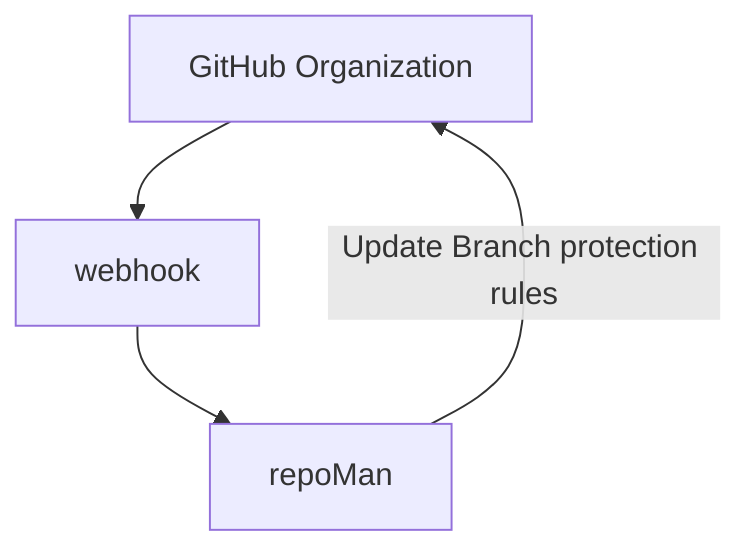
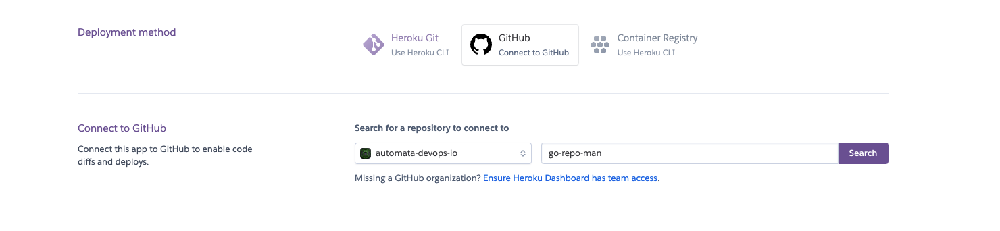

# go-repo-man
***A settings manager for GitHub repositories***

**Note**:  The code in this repository shows one of many ways to manage your repo security. It is not intended to be used outside of a development environment. Do so at your own risk.

## Table of contents

- [Summary](#summary)
  - [What's Needed?](#whats-needed)
  - [Getting Started](#getting-started)
    - [Microservice - Structure](#microservice---structure)
	- [Microservice - Testing](#microservice---testing)
	- [Microservice - Let's Deploy!](#microservice---lets-deploy)
	- [Creating the Webhook](#creating-the-webhook)
- [References Material](#reference-materials)
- [What's Next](#whats-next)

## Summary

 As many companies are moving towards policy driven resource management, this project has been created as an example of how to manage your `Organizations` GitHub repositories as code. The microservice created serves 2 functions. The primary(main?) function is to act as an ingress point for your GitHub `Organizations` webhooks which notifies the `repoMan` function to secure your newly created repositories using `branch protection rules`. For more information on what rules are available click [here](https://docs.github.com/en/repositories/configuring-branches-and-merges-in-your-repository/defining-the-mergeability-of-pull-requests/managing-a-branch-protection-rule)

For this project we are using a **GoLang** microservice as a notification ingress point for GitHub webhooks. Once a notification payload is received, we send a our `branch protection rules` with the GitHub REST [API](https://docs.github.com/en/rest) using the [GitHub REST API client for Golang](https://github.com/google/go-github) from [Google](https://github.com/google). Go was chosen for it's ability to be compact and compiled for any OS and eaze of containterization.

## What's Needed?

- **Go**: Go `v1.18.3` was used for all local development and testing. All required submodules can be found in the [go.mod](go.mod) file or in the import secion of the [main.go](main.go). It was tested with both `v1.17.1` and `v1.18.3` of **GoLang**. For information on installing **GoLang** see the documentation [here](https://go.dev/doc/install)
- **GitHub Organization**:  You will need a GitHub `Organization` to test this example. A free tier Organization will allow you to test with public repositories. It is strongly suggested that you  use a test organization first so that changes are not accidentally introduced into production environments. [See Info](https://docs.github.com/en/organizations/collaborating-with-groups-in-organizations/creating-a-new-organization-from-scratch)
- **Github Access**: You will need a github account with Administrative rights to the Organization for setting up an organization webhook.
- **GitHub Organization Webhook**: You will need to create an Organization webhook to communicate with your microservice.
  - **Note**: you will want to create a secret for your webhook and store it for later use
- **Hosting for Web App**: This microservice can be deployed to any webserver that has a publicly available dns address. AWS ECS with Fargate, EC2, AZURE, Heroku etc.  [Heroku](https://www.heroku.com/) was used in this example.

## Getting Started

Once compiled, the code in this repository runs as a standalone microservice to ingest, validate, and act upon webhook events from a GitHub organization. This will apply default configurations to all newly created repositories and their default branch.



**Note**: For this exercise we will apply the following rules
- Pull Requests require review
- Pull Requests require 2 approvals
- Rules are enforced for admins
- Require Code owner review

We will also be creating the `main` branch and `Readme.md` as well as creating an issue to notify us that the rules were enforced

#### Microservice - Structure

- `main.go`: All functional logic is contained in this file.

  - The `main` function creates our listening service using go's builtin `net/http` libraries with a function handler to communicate with the `go-github` library.

	**Note**: The `/test` endpoint is only used for our testing. The webhook in GitHub will be using the `/webhook` endpoint. Our `/webhook` endpoint is expecting a `secret` to be configured for the webhook which was difficult to mock due to the way GitHub creates the secret header.

  ```go
	func main() {
		port := os.Getenv("PORT")
		log.Info("server started")
		http.HandleFunc("/test", repoList)
		http.HandleFunc("/webhook", repoMan)
		log.Fatal(http.ListenAndServe(":"+port, nil))
	}
  ```

  - the `repoMan` function parses the payload from our GitHub webhook, validates the type of event and, sends instructions back to the Github API based on the event type.

  The first section handles client connection
  ```go
  func repoMan(w http.ResponseWriter, r *http.Request) {
	ctx := context.Background()
	// flag.Parse()
	context := context.Background()
	tokenService := oauth2.StaticTokenSource(
		&oauth2.Token{AccessToken: ghtoken},
	)
	tokenClient := oauth2.NewClient(context, tokenService)

	client := github.NewClient(tokenClient)
  ```

  This section handles payload verification and and parses the events

  ```go
  	payload, err := github.ValidatePayload(r, []byte(whsecret))
	if err != nil {
		log.Printf("error validating request body: err=%s\n", err)
		return
	}
	defer r.Body.Close()

	event, err := github.ParseWebHook(github.WebHookType(r), payload)
	if err != nil {
		log.Printf("could not parse webhook: err=%s\n", err)
		return
	}
  ```

  Finally, this section is a portion of the decision engine that sends instructions to the GitHub API. For more information on how this library works with the API see [here](https://pkg.go.dev/github.com/google/go-github@v17.0.0+incompatible/github#RepositoriesService.UpdateBranchProtection)

  ```go
	case *github.RepositoryEvent:
		//https://docs.github.com/en/developers/webhooks-and-events/webhooks/webhook-events-and-payloads#repository
		// this is a repository event
		// this is where we manage the security settings
		if e.Action != nil && *e.Action == "created" {
			log.Info("new repository created. configuring security %s\n")
			opt := &github.RepositoryContentFileOptions{
				Message:   github.String("initial commit"),
				Content:   []byte(*github.String("# " + *e.Repo.Name)),
				Branch:    github.String("main"),
				Committer: &github.CommitAuthor{Name: github.String("Jeff Brimager"), Email: github.String("jbrimager@automata-devops.io")},
			}
			issue := &github.IssueRequest{
				Title:    github.String("New repo Created"),
				Body:     github.String("@sam1el this repo was created with the following rules applied\n - Require Pull Request Review\n - Requires 2 Approvers\n - Dismiss Stale Reviews\n - Require CodeOwner Review"),
				Assignee: github.String("sam1el"),
			}
			preq := &github.ProtectionRequest{
				EnforceAdmins: true,
				RequiredPullRequestReviews: &github.PullRequestReviewsEnforcementRequest{
					RequiredApprovingReviewCount: 2,
					DismissStaleReviews:          true,
					RequireCodeOwnerReviews:      true,
				},
			}
			client.Repositories.CreateFile(ctx, *org, *e.Repo.Name, "README.md", opt)
			client.Repositories.UpdateBranchProtection(ctx, *org, *e.Repo.Name, "main", preq)
			client.Repositories.AddAdminEnforcement(ctx, *org, *e.Repo.Name, "main")
			client.Issues.Create(ctx, *org, *e.Repo.Name, issue)
		}
    ```

- You will need the follwing environment variables in heroku:
  - `PORT`: **required**, In heroku the app will use the default port that is set by the provider `:5000` to determine what port should be used for bind when starting the application. You can set this to any port you like.
  - `GHTOKEN`: **required**, This is a Personal Access Token creted in your github account. It will be use by the `go-github` client in the `repoMan` function to communicate with the Github API
  - `WHSECRET`: **required**, Used by `repoMan`, to validate the payload recieved is from our `Organizations` webhook.

### Microservice - Testing

Now we're going run this locally and do some testing to make sure our microservice is running as expected. First, lets make sure we have [what's needed](#whats-needed)

- Create a local copy of the code by cloning the repo
	```shell
	➜ git clone git@github.com:automata-devops-io/go-repo-man.git
	```
	You will have similar output to below:
	```shell
	➜ git clone git@github.com:automata-devops-io/go-repo-man.git
		Cloning into 'go-repo-man'...
		remote: Enumerating objects: 135, done.
		remote: Counting objects: 100% (135/135), done.
		remote: Compressing objects: 100% (97/97), done.
		remote: Total 135 (delta 77), reused 83 (delta 32), pack-reused 0
		Receiving objects: 100% (135/135), 66.31 KiB | 1.70 MiB/s, done.
		Resolving deltas: 100% (77/77), done.
	```
- Make sure go is installed and you have a similar version:
	```shell
	➜ go version
	go version go1.18.3 darwin/amd64
	```
	For help installing and configuting go look [here](https://go.dev/doc/install)

- Now lets make sure we have all required modules installed
	```shell
	➜ go mod tidy
	```

- Set up our local variables
	```shell
	export PORT="3000"
	export GHTOKEN="ghp_MYTOKENISCOOLERTHANYOURS"
	export WHSECRET="YOUSHOULDSEEMYSECRETTHO"
	```

- Finally we start our service
	```shell
	➜ go run main.go
	INFO[0000] server started
	```
	Now that the server is up lets hit our test endpoint which will return a list of repos. We will use curl for this exercise but, you could use Postman or any other tool you choose.
	```shell
  ➜ curl http://localhost:3000/test

  {"id":503119585,"node_id":"R_kgDOHfz-4Q","owner":{"login":"automata-devops-io","id":107265107,"node_id":"O_kgDOBmS8Uw","avatar_url":"https://avatars.githubusercontent.com/u/107265107?v=4","html_url":"https://github.com/automata-devops-io","gravatar_id":"","type":"Organization","site_admin":false,"url":"https://api.github.com/users/automata-devops-io","events_url":"https://api.github.com/users/automata-devops-io/events{/privacy}","following_url":"https://api.github.com/users/automata-devops-io/following{/other_user}","followers_url":"https://api.github.com/users/automata-devops-io/followers","gists_url":"https://api.github.com/users/automata-devops-io/gists{/gist_id}","organizations_url":"https://api.github.com/users/automata-devops-io/orgs","received_events_url":"https://api.github.com/users/automata-devops-io/received_events","repos_url":"https://api.github.com/users/automata-devops-io/repos","starred_url":"https://api.github.com/users/automata-devops-io/starred{/owner}{/repo}","subscriptions_url":"https://api.github.com/users/automata-devops-io/subscriptions"}}
	```

### Microservice - Let's Deploy!

Having verified we have the mimimum requirements met, we are going to deploy our microservice. For this step we will be using `Heroku` connected to our repo directly for deployments. You could also use Docker, Terraform, AWS, AZURE or, any other service that allows you a publicly accessible endpoint. [See Examples](examples)

This repository is pushed to Heroku where Environment variables are passed to the application as `Config Vars`. You can do this via the cli or in the heroku interface. More information can be found setting up with go [here](https://devcenter.heroku.com/categories/go-support)

Below is what it would look like on the heroku site.

- Setting up variables

	


- Configuring link to GitHub

	

  Once you have connected your repo to github, heroku will rebuild your service any time you push your code to main.

  ```shell
  ➜ git push -u origin main
  ```

- Verify your build in GitHub

	

- You can also visualize this in heroku

	

	If you click the `View build log` link you are presented with the following
	```shell
	-----> Building on the Heroku-20 stack
	-----> Using buildpack: heroku/go
	-----> Go app detected
	-----> Fetching stdlib.sh.v8... done
	----->
		Detected go modules via go.mod
	----->
		Detected Module Name: github.com/automata-devops-io/go-repo-man
	----->
	-----> Using go1.18.3
	-----> Determining packages to install
		Detected the following main packages to install:
		github.com/automata-devops-io/go-repo-man
	-----> Running: go install -v -tags heroku github.com/automata-devops-io/go-repo-man
		github.com/automata-devops-io/go-repo-man
		Installed the following binaries:
			./bin/go-repo-man
	-----> Discovering process types
		Procfile declares types -> web
	-----> Compressing...
		Done: 4.1M
	-----> Launching...
		Released v36
		https://adevrepoman.herokuapp.com/ deployed to Heroku
	```

### Creating the Webhook

Now that we have the microservice deployed, we need to create the webhook to bring it all together. You can find information on creating a webhook in your organization [here](https://docs.github.com/en/developers/webhooks-and-events/webhooks/creating-webhooks)

To set up your webhook you will need at minimum a `Payload URL`, `Content type` and to select your `Event types`. You can see below how it looks in Github


As you can see, we have selected to have all events sent as we plant to expand upon this module but for now, you will want to select `Let me select individual events` and then check the box for `repositories`. We have also configured our webhook with a secret. This is what you will provide to the `WHSECRET` environment variable.

With the webhook configured we are now ready to start sending data to our microservice for processing. Each time you create a new repo, a webhook event is triggered. If you would like to verify delivery, this can done in your organizaition as well. (See the example below or further reading can be found [here](https://docs.github.com/en/developers/webhooks-and-events/webhooks/testing-webhooks))


**THAT'S IT!!!!!**

Now that the webhook and microservice are communicating, successful processing of repository events should result in the following.

- `Main` branch created
- `README.md` created with the repo name as the title
- `Branch protection rules` being enforced
- `Issue` created notifying you of rule enforcement with a list of the rules.
- `Issue` assigned to someone for review
	

### Reference Materials

All reference links in 1 convenient location
- More information on [Branch protection rules](https://docs.github.com/en/repositories/configuring-branches-and-merges-in-your-repository/defining-the-mergeability-of-pull-requests/managing-a-branch-protection-rule)
- GitHub Documentation for the [API](https://docs.github.com/en/rest)
- Usage of the [go-github library](https://github.com/google/go-github)
- Managing branch protection with [go-github](https://pkg.go.dev/github.com/google/go-github@v17.0.0+incompatible/github#RepositoriesService.UpdateBranchProtection) (**Note**: This also provides links to the relevant portions of the GitHub API)
- Accepting Github Webhooks with GO [tutorial](https://groob.io/tutorial/go-github-webhook/)


### What's Next?

There are some more functions I would like to add to make this a more robust solution.

- Another api endpoint in the microservice to apply the rules to preexisting repositories
- Handling of Pull Request events (Assigning users by default)
- Adding more default files to repository creation for pipeline management
- Write proper go testing for the api
